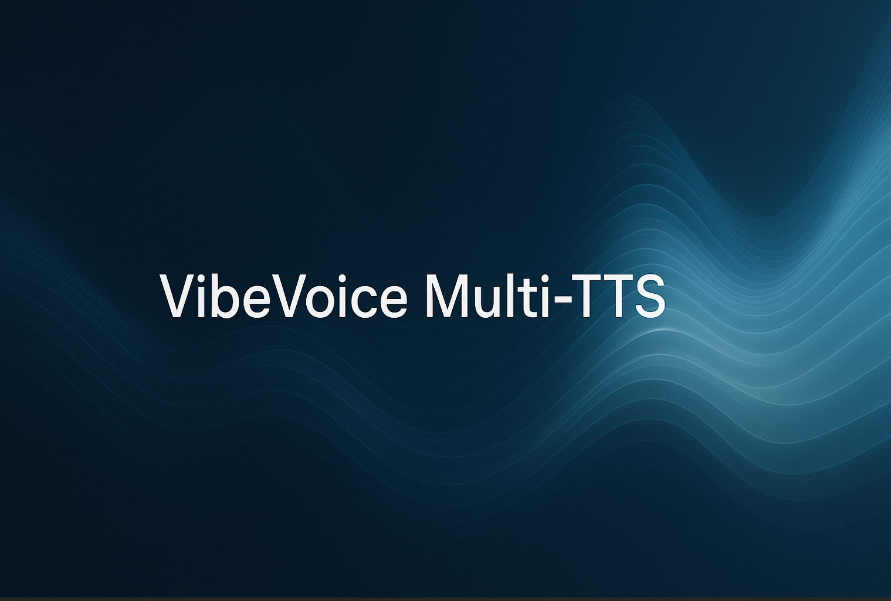

---

# VibeVoice Multi-TTS App



Multi-speaker Text-to-Speech application using Microsoft’s **VibeVoice** models.
Supports different model sizes (1.5B, 7B Large, and Large variants).

---

## Prerequisites

* **Python 3.9+**
* **FFmpeg** must be installed and available in PATH

  * [Download FFmpeg](https://ffmpeg.org/download.html)
  * Verify with:

    ```bash
    ffmpeg -version
    ```

---

## Installation

Clone the repository:

```bash
git clone https://github.com/YASSERRMD/vibevoice-multi-tts.git
cd vibevoice-multi-tts
```

Install dependencies:

```bash
pip install -r requirements.txt
```

---

## Running the App

Start the application with:

```bash
python app.py
```

---

## VRAM Requirements

Different models have different GPU memory (VRAM) needs.
Choose the model based on your available GPU.

| Model Variant        | Typical VRAM Usage | Recommended VRAM | Notes                                              |
|----------------------|--------------------|------------------|----------------------------------------------------|
| **VibeVoice 1.5B**  | ~7 GB              | 8 GB             | Handles up to 90-min speech with 64K context.      |
| **VibeVoice 7B**    | ~17–19 GB          | 24 GB            | Higher fidelity, ~45-min speech with 32K context.  |
| **VibeVoice Large** | ~19–20 GB          | 28 GB            | Full ~9B model, optimized for long-form synthesis. |

---

## Model Selection

* Default: **1.5B** (lightweight, widely compatible).
* For higher-quality output: use **7B Large**.
* For mid-range GPUs: use **Large-Quant-4bit**.

---

## Notes

* Ensure **FFmpeg** is installed before running, otherwise audio processing will fail.
* Quantized models significantly reduce VRAM usage and storage size.
* For multi-hour audio generation, ensure sufficient disk space and GPU memory.

---

Would you like me to also add **example commands/code snippets** (like how to switch between 1.5B and 7B inside `app.py`) so users can quickly try different models?
